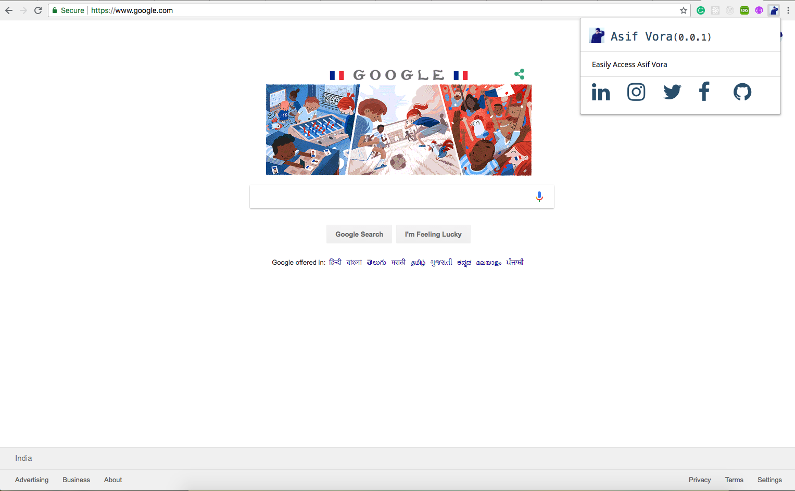
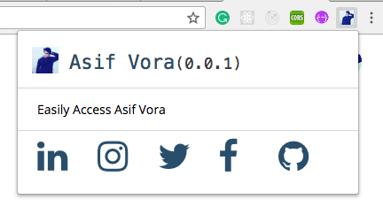

# Building a Chrome Extension Using React
Building a simple Chrome extension using React.

# Screenshot



## Getting Started

For help getting started with React, view online
[documentation](https://reactjs.org/).

#### 1. [Setup React](https://reactjs.org/docs/try-react.html)

#### 2. Clone the repo

```sh
$ https://github.com/asifvora/chrome-extension.git
$ cd chrome-extension/
```

#### 3. Install dependency

```sh
$ npm install
```

#### 4. Run the app

```sh
$ npm start
```

#### 5. Build the app

```sh
$ npm run build
```

### Adding The Manifest

Chrome extensions need to have a manifest.json file in their root folder. That manifest tells Chrome how to create the extension and how to run it. In the manifest you will configure things like logo, name and description of your extension. Since you will want to make the manifest as part of your build root folder, I suggest to put it in the project’s public folder. In create-react-app the public folder is just copied as is to the build folder when you compile the project. Other things that I suggest to put in the public folder include content and background scripts and assets.

create-react-app already includes a manifest.json file in the public folder. override the file with the following manifest:

```json
{
  "manifest_version": 2,
  "name": "My Extension",
  "description": "This extension is a starting point to create a real Chrome extension",
  "version": "0.0.1",
  "author": "Asif Vora",
  "browser_action": {
    "default_popup": "index.html",
    "default_title": "Open the popup"
  },
  "icons": {
    "16": "logo-small.png",
    "48": "logo-small.png",
    "128": "logo-small.png"
  },
  "permissions": ["activeTab"]
}
```

What is included in this manifest.json?
We have the manifest version, name and description which are self explanatory. The browser_action section tells Chrome that we will have a popup which will run the index.html file. The icons will be used to present the the icon in the extension tray and in Chrome extension list. Last but not least, the permissions array will include all the permissions that the extension will need to operate successfully. Currently it is left empty.

You can add any image, which is 128 pixel wide, to the public folder with the name logo-small.png (or change that name in the manifest to your logo image name).

Now that we have the manifest and logo, you can compile the project using the following code in your command line:

```sh
$ npm run build
```

### Adding The Extension to Your Chrome

In order to check your new extension, you will have to install it in Chrome. You can do the following to install it:

In Chrome, open the extension list by opening a new tab and running the following URL:

```sh
$ chrome://extensions/
```
Press the Load unpacked extension… button. 
Browse to the build folder and press the OK button.

If everything goes right, you will have your extension installed in Chrome.



## Questions?🤔 
  
Hit me on [](https://twitter.com/007_dark_shadow)
[](https://medium.com/@asifvora)
[](https://www.linkedin.com/in/asif-vora/) 
[](https://www.instagram.com/007_dark_shadow/) 


## License

Copyright (c) Asif Vora

Permission is hereby granted, free of charge, to any person obtaining a copy
of this software and associated documentation files (the "Software"), to deal
in the Software without restriction, including without limitation the rights
to use, copy, modify, merge, publish, distribute, sublicense, and/or sell
copies of the Software, and to permit persons to whom the Software is
furnished to do so, subject to the following conditions:

The above copyright notice and this permission notice shall be included in all
copies or substantial portions of the Software.

THE SOFTWARE IS PROVIDED "AS IS", WITHOUT WARRANTY OF ANY KIND, EXPRESS OR
IMPLIED, INCLUDING BUT NOT LIMITED TO THE WARRANTIES OF MERCHANTABILITY,
FITNESS FOR A PARTICULAR PURPOSE AND NONINFRINGEMENT. IN NO EVENT SHALL THE
AUTHORS OR COPYRIGHT HOLDERS BE LIABLE FOR ANY CLAIM, DAMAGES OR OTHER
LIABILITY, WHETHER IN AN ACTION OF CONTRACT, TORT OR OTHERWISE, ARISING FROM,
OUT OF OR IN CONNECTION WITH THE SOFTWARE OR THE USE OR OTHER DEALINGS IN THE
SOFTWARE.
